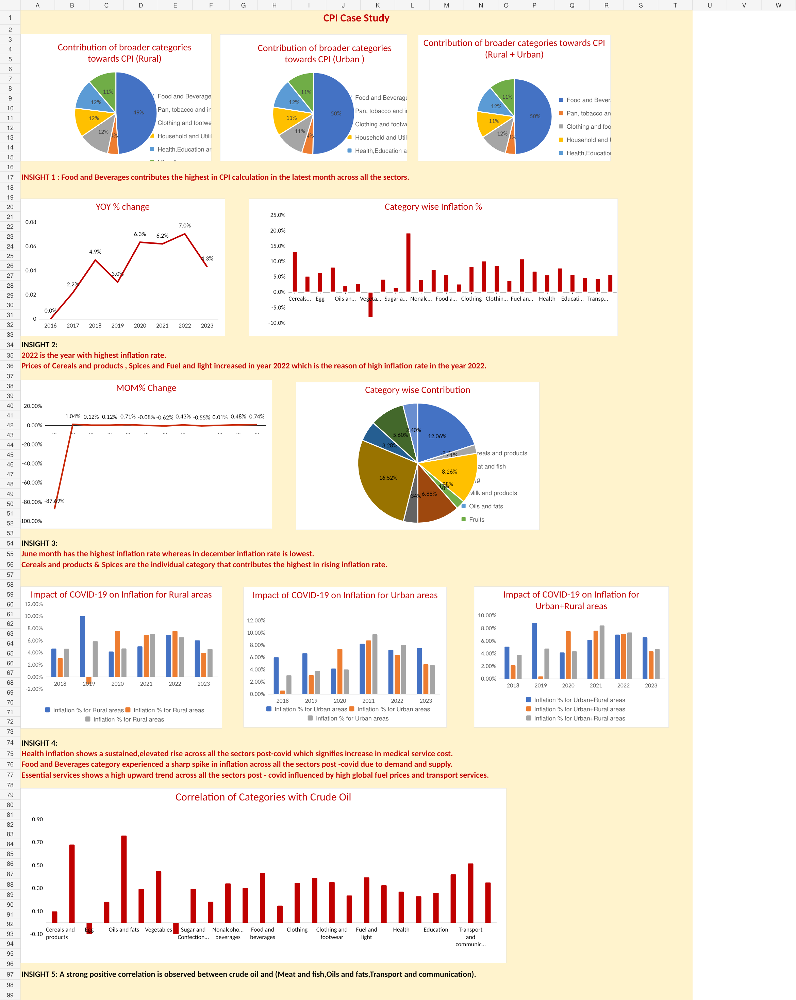
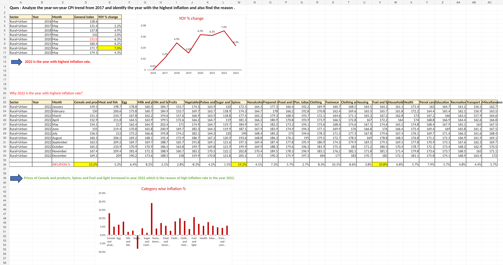
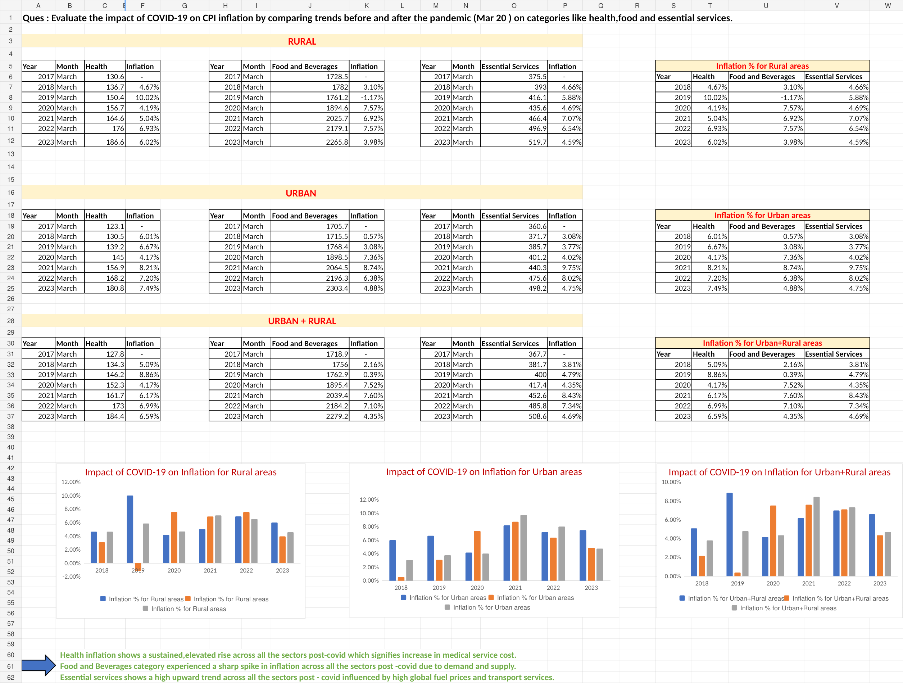
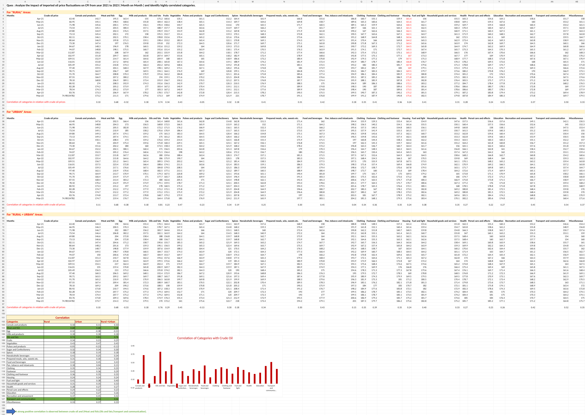

# 📊 cpi-inflation-analysis-excel

> An end-to-end Excel analytics case study exploring CPI trends, inflation drivers, COVID-19 impact, and the relationship between crude oil prices and CPI categories.

---

## 📌 Project Overview

This project analyzes Consumer Price Index (CPI) data to understand how inflation evolved across **Rural, Urban, and Rural + Urban** sectors.

The analysis covers CPI trends from **January 2013 to May 2023** and combines data cleaning, transformation, exploratory analysis, time-series analysis, comparative analysis, visualization, and business insight generation.

The project was structured around five analytical business questions designed to identify the major drivers and patterns behind inflation.

---

## 🎯 Business Objectives

The analysis aims to:

- Identify the major categories contributing to CPI
- Analyze year-over-year (YoY) inflation trends
- Identify periods of higher inflation and investigate potential drivers
- Analyze food inflation trends and category-level contribution
- Evaluate the impact of COVID-19 on key CPI categories
- Investigate the relationship between crude oil prices and CPI categories
- Compare inflation patterns across Rural, Urban, and combined sectors

---

## 📁 Dataset

### CPI Dataset

**Period:** January 2013 – May 2023

The CPI dataset contains monthly observations across:

- Rural
- Urban
- Rural + Urban

The dataset includes a broad range of CPI categories such as:

- Food and Beverages
- Cereals and Products
- Meat and Fish
- Egg
- Milk and Products
- Oils and Fats
- Fruits
- Vegetables
- Pulses and Products
- Sugar and Confectionery
- Spices
- Fuel and Light
- Health
- Education
- Transport and Communication
- Clothing and Footwear
- Housing
- Miscellaneous
- General Index

### Crude Oil Dataset

A crude oil price dataset from the **Petroleum Planning & Analysis Cell (PPAC)** was incorporated for the oil-price analysis.

The crude oil analysis focuses on the relationship between imported crude oil price movements and CPI categories during **2021–2023**.

---

## 🧹 Data Preparation & Cleaning

The workbook includes a dedicated **Missing values** analysis to identify incomplete observations in the CPI dataset.

Key preparation steps included:

- Identifying missing values using Excel functions
- Filling required missing CPI observations
- Standardizing the analytical dataset
- Creating month-number fields for time-based analysis
- Aggregating individual CPI categories into broader groups
- Preparing datasets for sector-level and category-level analysis
- Combining CPI and crude oil data for correlation analysis

---

## 📊 Analytical Approach

### 1. Category Contribution Analysis

Analyzed the contribution of broader CPI categories across:

- Rural
- Urban
- Rural + Urban

This helped identify the categories with the largest contribution to CPI in the latest available month.

### 2. Year-over-Year Inflation Analysis

Calculated YoY changes in the General Index to compare inflation across years from **2017 onward**.

The analysis identified **2022** as the year with the highest inflation in the selected comparison.

### 3. Food Inflation Analysis

Analyzed food-category price movements from **June 2022 to May 2023**.

The analysis compared monthly food-category values across Rural, Urban, and Rural + Urban sectors and examined category-level inflation changes.

### 4. COVID-19 Impact Analysis

Compared CPI movements before and after the COVID-19 period, using **March 2020** as the reference point.

The analysis focused on:

- Health
- Food and Beverages
- Essential Services

The comparison was performed separately for Rural, Urban, and Rural + Urban sectors.

### 5. Crude Oil & CPI Relationship

Analyzed monthly crude oil price movements against CPI categories for **2021–2023**.

Correlation analysis was used to identify CPI categories that moved more closely with crude oil prices.

---

## 🔍 Key Findings

### Food & Beverages

Food and Beverages was identified as the **largest contributing broader category** in the latest month analyzed across the examined sectors.

### 2022 Inflation

The year **2022** recorded the highest inflation in the selected year-over-year comparison.

The analysis linked the higher inflation level to increases in categories such as:

- Cereals and Products
- Spices
- Fuel and Light

### Food Inflation

The monthly food analysis identified **June** as the month with the highest inflation rate in the selected period, while **December** recorded the lowest.

At the individual-category level, **Cereals and Products** and **Spices** showed the strongest contribution to the increase in food inflation in the analysis.

### COVID-19 Impact

Post-COVID analysis showed notable increases in:

- Health-related inflation
- Food and Beverage inflation
- Essential service costs

The analysis highlights how the pandemic period coincided with changes in both essential consumption categories and service-related prices.

### Crude Oil Relationship

The crude oil analysis identified a **strong positive relationship** between crude oil prices and selected CPI categories, particularly:

- Meat and Fish
- Oils and Fats
- Transport and Communication

---

## 📈 Visualizations

### 📊 CPI Analysis Dashboard



The dashboard provides a high-level view of CPI contribution, inflation trends, MoM changes, COVID-19 impact, and crude oil relationships.

---

### 📈 YoY Inflation Analysis



This analysis compares year-over-year inflation and investigates the categories contributing to higher inflation levels.

---

### 🦠 COVID-19 Impact Analysis



The analysis compares inflation behavior across Rural, Urban, and Rural + Urban sectors before and after the COVID-19 period.

---

### 🛢️ Crude Oil & CPI Correlation



Correlation analysis was used to examine the relationship between crude oil prices and selected CPI categories.

## 🛠️ Tools & Skills Demonstrated

### Tools

- Microsoft Excel

### Analytical Skills

- Data Cleaning
- Missing Value Analysis
- Data Transformation
- Exploratory Data Analysis (EDA)
- Time-Series Analysis
- Month-over-Month (MoM) Analysis
- Year-over-Year (YoY) Analysis
- Category Contribution Analysis
- Sector Comparison
- Trend Analysis
- Correlation Analysis
- Data Visualization
- Business Insight Generation

### Excel Techniques

- IF
- COUNTBLANK
- SUM
- AVERAGE
- Percentage calculations
- Pivot-based analysis
- Charts and visualizations

---

## 📂 Project Structure

```text
cpi-inflation-analysis-excel/
│
├── CPI_Inflation_Analysis.xlsx
├── README.md
│
└── screenshots/
    ├── CPI_Dashboard_screenshot.png
    ├── yoy-inflation-analysis.png
    ├── covid-impact-analysis.png
    └── crude-oil-correlation.png
